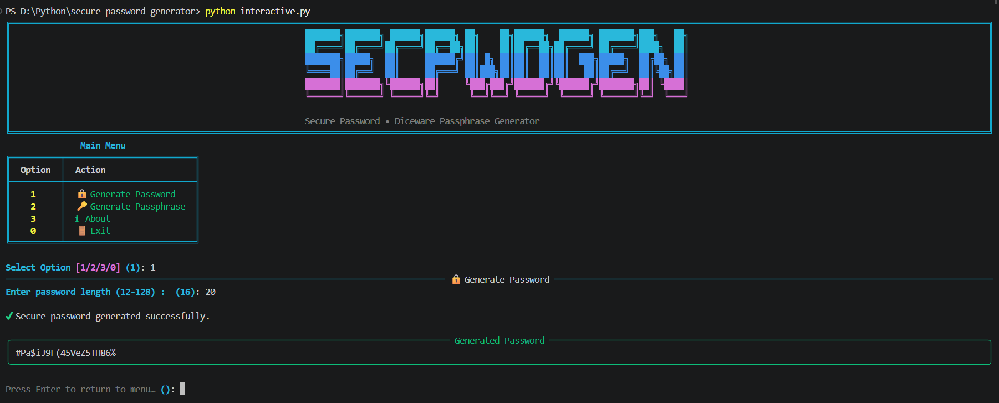
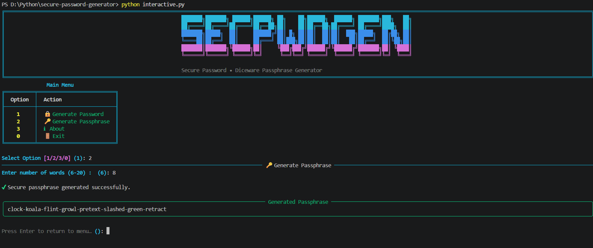
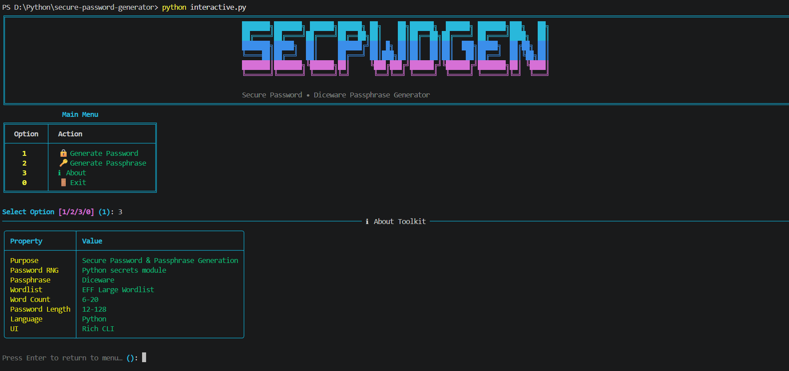
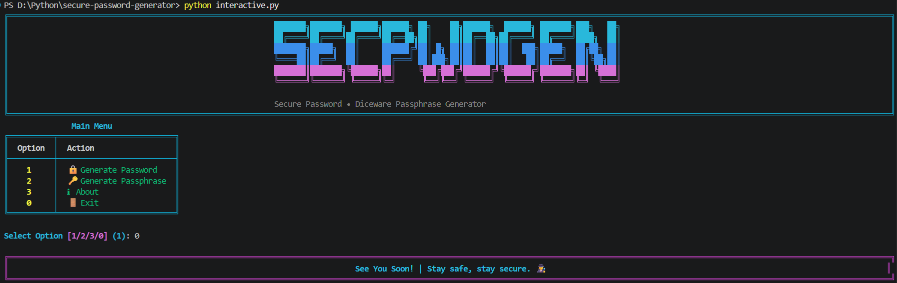

# 🔑 Secure-Password-Generator 🔐

A Python-based **Secure Password & Passphrase Generator** Command Line Tool that lets you generate **cryptographically strong random passwords** and **Diceware-style passphrases**, right from your terminal.
This CLI tool is built for **everyday account security**, **learning secure randomness in Python**, and **CTF/security practice**, combining a **simple no-dependency mode**, an **argument-based CLI**, and a **rich, colorful interactive CLI**.

---

## 🧱 Project Structure

```bash
secure-password-generator-python/
│
├── assets/              # Screenshots + EFF Diceware wordlist
├── main.py              # Basic CLI application
├── parser.py            # Argument-based CLI Version
├── interactive.py       # Rich CLI Version
├── requirements.txt     # Project Dependencies
├── LICENSE              # Project license
└── README.md            # Project documentation
```

---

## ✨ Features

### 🔒 Secure Password Generation

- Generates passwords using Python's **`secrets`** module (cryptographically secure RNG)
- Guarantees at least one **lowercase**, **uppercase**, **digit**, and **special character**
- Configurable length between **12–128 characters** (default: 16)
- Characters shuffled with `secrets.SystemRandom()` to avoid positional bias

### 🔑 Diceware Passphrase Generation

- Generates passphrases using the **EFF Large Wordlist** (7,776 words)
- Configurable word count between **6–20 words** (default: 6)
- Words joined with hyphens for a memorable yet strong passphrase
- Validates the wordlist on load (exact word count, no duplicates)

### ⌨️ Argparse CLI (`parser.py`)

- Non-interactive, subcommand-based generation — great for scripting and automation
- `pwd` subcommand with `-l`, `--length` flag for passwords
- `phr` subcommand with `-w`, `--words` flag for passphrases

### 🎨 Rich CLI Interface

- Colored terminal output with a custom banner
- Structured **About** table showing tool properties
- Styled panels for generated passwords/passphrases
- Handles invalid input and missing wordlist gracefully

### ⚡ Triple Mode Support

- 🧼 Basic CLI → Lightweight, menu-driven, no dependencies (`main.py`)
- ⌨️ Argparse CLI → Flag-based, script-friendly (`parser.py`)
- 🎨 Rich CLI → Enhanced UI with colors, panels and menus (`interactive.py`)

---

## 🛠 Technologies Used

| Technology   | Purpose                                |
| ------------ | -------------------------------------- |
| **Python 3** | Core language                          |
| **secrets**  | Cryptographically secure random values |
| **string**   | Character set definitions              |
| **argparse** | Flag-based CLI argument parsing        |
| **pathlib**  | Safe file path handling                |
| **Rich**     | Interactive CLI interface              |

---

## ▶️ How to Run

### 1️⃣ Clone the repository

```bash
git clone https://github.com/ShakalBhau0001/secure-password-generator-python.git
```

### 2️⃣ Enter the project directory

```bash
cd secure-password-generator-python
```

### 3️⃣ Install Dependencies

```bash
pip install rich
```

**OR**

```bash
pip install -r requirements.txt
```

> ℹ️ The Basic CLI (`main.py`) and Argparse CLI (`parser.py`) need **no external dependencies** — Rich is only required for `interactive.py`.

### 4️⃣ Running the Project

#### Basic CLI Version

```bash
python main.py
```

#### Argparse CLI Version

```bash
python parser.py pwd -l 25
python parser.py pwd --length 20
python parser.py phr -w 10
python parser.py phr --words 8
```

#### Rich Interactive Version

```bash
python interactive.py
```

---

## ▶️ Usage

### Basic CLI (`main.py`)

```bash
=============================================
       SECURE PASSWORD GENERATOR
=============================================
[1] Generate Password
[2] Generate Passphrase
[3] Exit
=============================================

Select option: 1
Enter password length (12-128) [default: 16]: 20

Generated Password:
qT8#pR2!vLk9@sZ1nB7$
```

```bash
Select option: 2
Enter number of words (6-20) [default: 6]: 8

Generated Passphrase:
correct-battery-horse-staple-forest-lantern-window-drift
```

### Argparse CLI (`parser.py`)

#### 1. Generate a password

```bash
python parser.py pwd -l 24
```

```bash
python parser.py pwd --length 16
```

#### 2. Generate a passphrase

```bash
python parser.py phr -w 6
```

```bash
python parser.py phr --words 10
```

### Rich Interactive CLI (`interactive.py`)

```bash
[1] 🔒 Generate Password
[2] 🔑 Generate Passphrase
[3] ℹ About
[0] 🚪 Exit

Select Option: 1
Enter password length (12-128) [default: 16]: 18

✔ Secure password generated successfully.
```

---

## 📁 Supported Options

- **Password Length:** 12–128 characters (default: 16)
- **Passphrase Word Count:** 6–20 words (default: 6)
- **Character Set:** Lowercase, uppercase, digits, and special characters (`!@#$%^&*()-_=+`)
- **Wordlist:** EFF Large Wordlist (`assets/eff_large_wordlist.txt`, 7,776 words)

> ⚠️ Password/passphrase strength depends on length/word count — longer is always stronger.

---

## ⚙️ How It Works

**1️⃣ Password Generation**

- One character each from lowercase, uppercase, digits, and special sets is guaranteed
- Remaining characters filled from the combined character pool using `secrets.choice`
- Final list shuffled with `secrets.SystemRandom().shuffle` to randomize character order

**2️⃣ Passphrase Generation**

- EFF Large Wordlist is loaded and validated (exact count, no duplicates)
- Requested number of words picked using `secrets.choice`
- Words joined with hyphens to form the final passphrase

---

## ⚠️ Common Errors

- **Length/word count out of range** → Raises a clear `ValueError` with the valid range
- **Non-numeric input** → Handled with a "please enter a valid number" message
- **Wordlist missing or corrupted** → `FileNotFoundError` / `ValueError` with details
- **Missing required subcommand** (Argparse CLI) → `argparse` prints usage and exits

---

## 🌟 Future Enhancements

- Option to exclude ambiguous characters (e.g. `0`, `O`, `l`, `1`)
- Copy generated password/passphrase directly to clipboard
- Password strength meter / entropy estimate in the output
- Bulk generation of multiple passwords or passphrases at once
- Custom wordlist support for passphrases

---

## 📦 Related Projects

This repository focuses on a **specific secure-randomness technique** implemented
as a **command-line (CLI) learning project**.

The goal of this project is to:

- Understand how to generate cryptographically secure secrets in Python
- Practice the **Diceware** method for memorable, strong passphrases
- Learn how simple CLI-based security tools are structured

For more advanced, security-focused CLI tools, check out:

> 🔗 **[CLI Projects](https://github.com/stars/ShakalBhau0001/lists/cli-projects)**

---

## ⚠️ Disclaimer

> This project is intended for **educational and learning purposes only**.

> _While it uses Python's `secrets` module for cryptographic randomness, always follow your organization's or service's password policy for real-world use._

---

## 📸 Preview

### 1. **Generate Password**



### 2. **Generate Passphrase**



### 3. **About**



### 4. **Exit**



---

## 🪪 Author

> **Creator: Shakal Bhau**

> **GitHub: [ShakalBhau0001](https://github.com/ShakalBhau0001)**

---

## ⭐ Support

If you like this project, consider giving it a ⭐ on GitHub!

---
